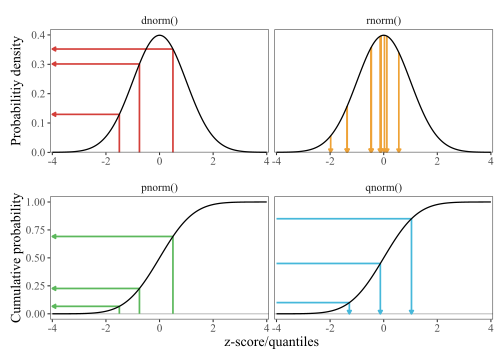

---
format:
  revealjs:
    theme: default
    slide-number: c
    highlight-style: github
    code-copy: true
    embed-resources: true
    code-line-numbers: false
    css: ddss.css
    height: 900
    width: 1600
    output-location: fragment
    fig-width: 8
    fig-height: 3.5

execute:
  echo: true
  message: false
  warning: false

knitr:
  opts_chunk:
    results: hold
    fig.align: center
---

```{=html}
<style>
  .reveal .backgrounds > .slide-background:first-child {
    background-image: url('figs/title-bg.svg');
    background-size: cover;
    background-position: center;
  }
</style>

<br>
<br>
<br>
<h1>R Bootcamp: Day 3 PM</h1>
<br>
<h2>Probability (sort of) and simulation in R</h2>
<hr><br>
<div style="display: flex; align-items: center; justify-content: space-between; padding: 0 2rem;">
  <div>
    <p style="font-size: 1.3em; font-weight: 600; margin: 0 0 0.2em 0;">Eric Manning</p>
    <p style="font-size: 1.0em; margin: 0;">September 1, 2026</p>
  </div>
  
</div>
<br><br>
```

<center>[princeton-ddss.github.io/r-bootcamp](https://princeton-ddss.github.io/r-bootcamp)</center>

```{r}
#| label: setup
#| include: false

options(scipen = 999, width = 78)

# trim base R figure margins (default mar reserves ~4 blank lines up top);
# chunks that draw a main= title override via {r, small_mar=c(4.1,4.1,2.8,0.9)}
knitr::knit_hooks$set(small_mar = function(before, options, envir) {
    if (before && is.numeric(options$small_mar)) par(mar = options$small_mar)
})
knitr::opts_chunk$set(small_mar = c(4.1, 4.1, 1.2, 0.9))

library(dplyr)
library(readr)
library(ggplot2)

counties <- left_join(
    read_csv("../files/county_data.csv"),
    read_csv("../files/county_population.csv"),
    join_by(GEOID == fips)
)
```

## This session

<hr> <br>

### 1) Drawing random numbers

::: {.fragment fragment-index="1"}
- `sample()`, `set.seed()`, and a couple of named distributions
- The `d`/`p`/`q`/`r` family
:::

<br>

### 2) Simulation

::: {.fragment fragment-index="2"}
- Wax on, wax off
:::

<br>

::: {.fragment fragment-index="3"}
We are **not** teaching statistics today. We are showing you the machinery, so the
concepts seem vaguely familiar later.
:::

## Some sources

<hr> <br>

- Long and Teetor, *R Cookbook*, 2e
  - [Ch. 8: Probability](https://rc2e.com/probability) — the whole chapter is recipes for today
- Harvard IQSS, *Math Prefresher for Political Scientists*
  - [Ch. 12: Simulation](https://iqss.github.io/prefresher/16_simulation.html) — where this afternoon's exercise comes from
- Mercer, [A brief visualization of R's distribution functions](https://wetlandscapes.com/blog/a-brief-visualization-of-rs-distribution-functions/)
- [Plot probability distribution function in R](https://www.geeksforgeeks.org/r-language/plot-probability-distribution-function-in-r/) (GeeksforGeeks)

<br>

::: fragment
**Additional:** [Geyer, *Distributions in R*](https://www.stat.umn.edu/geyer/old/5101/rlook.html) — a one-page
lookup table for every distribution R ships with. Bookmark it.
:::

# Drawing random numbers

## `sample()`: draw from a vector

<hr> <br>

Give it something to draw from and how many draws you want:

```{r}
sample(1:10, size = 5)
```

::: fragment
<br>
With no `size`, you get a **permutation** — the whole vector, reshuffled:

```{r}
sample(1:10)
```
:::

## With or without replacement

<hr> <br>

By default, each element can be drawn **once**. `size` can't exceed the vector:

```{r}
#| error: true
sample(1:5, size = 10)
```

::: fragment
<br>
`replace = TRUE` puts each draw back in the bag:

```{r}
sample(1:5, size = 10, replace = TRUE)
```
:::

## A coin, ten times

<hr> <br>

The vector doesn't have to be numbers:

```{r}
sample(c("heads", "tails"), size = 10, replace = TRUE)
```

## An unfair coin: `prob`

<hr> <br>

`prob` weights the draws. It lines up with the vector you're sampling from:

```{r}
sample(c("heads", "tails"), size = 10, replace = TRUE, prob = c(0.9, 0.1))
```

<br>

::: fragment
`prob` gets normalized, so `c(9, 1)` and `c(0.9, 0.1)` behave identically.
:::

## Your results won't match mine

<hr> <br>

Run the same line twice:

```{r}
sample(1:100, 4)
sample(1:100, 4)
```

<br>

::: fragment
Results are not reproducible between runs.
:::

## `set.seed()`

<hr> <br>

R's randomness is **not** random — it's a deterministic sequence that
looks random. `set.seed()` says where to start:

```{r}
set.seed(2026)
sample(1:100, 4)

set.seed(2026)
sample(1:100, 4)
```

## Using `set.seed()` in practice

<hr> <br>

- Set it **once**, near the top of the script, with any integer you like
- Then never touch it again in that script

## Two distributions worth naming

<hr> <br>

### Bernoulli

::: {.fragment fragment-index="1"}
One trial, two outcomes, probability `p` of a 1/T/'yes'/etc. *A (biased?) coin flip.*
:::

<br>

### Uniform

::: {.fragment fragment-index="2"}
Every value in a range is equally likely.
:::

## Bernoulli draws: `rbinom()`

<hr> <br>

`size = 1` means one coin per draw; `prob` is the chance of a 1:

```{r}
set.seed(2026)
rbinom(n = 20, size = 1, prob = 0.5)
```

::: fragment
<br>
Bump `size` and each draw becomes *"how many heads in `size` flips?"*:

```{r}
rbinom(n = 10, size = 100, prob = 0.5)
```
:::

## Uniform draws: `runif()`

<hr> <br>

`runif(n)` gives `n` values between 0 and 1, none more likely than any other:

```{r}
set.seed(2026)
runif(5)
```

::: fragment
<br>
`min` and `max` move the range:

```{r}
runif(5, min = 10, max = 20)
```
:::

## What "uniform" looks like

<hr> <br>

```{r, small_mar=c(4.1, 4.1, 2.8, 0.9)}
#| fig-height: 4.4
set.seed(2026)
hist(runif(10000), breaks = 40, main = "10,000 draws from runif()")
```

## And now one we're not going to explain

<hr> <br>

```{r, small_mar=c(4.1, 4.1, 2.8, 0.9)}
#| fig-height: 4.4
set.seed(2026)
hist(rnorm(10000), breaks = 40, main = "10,000 draws from rnorm()")
```

::: fragment
This is the **normal distribution**. Note the shape and move on.
:::

## `rnorm()` arguments

<hr> <br>

`mean` centers it, `sd` sets its width. The defaults are 0 and 1:

```{r}
set.seed(2026)
rnorm(5)
rnorm(5, mean = 100, sd = 15)
```

<br>

::: fragment
Every `r*()` function follows this shape: how many draws, then the knobs for that distribution.
:::

# The `d` / `p` / `q` / `r` family

## One distribution, four questions

<hr> <br>

Every distribution in R comes as four functions sharing one name stem:

| Prefix | Question it answers | Normal |
|:-------|:--------------------------|:-----------|
| `r`    | Give me random draws | `rnorm()` |
| `d`    | How dense/tall is the curve here? | `dnorm()` |
| `p`    | How much of the distribution's mass lies below here? | `pnorm()` |
| `q`    | Which value has this much below it? | `qnorm()` |


## Visualized

<hr>

{fig-align="center" width="62%"}

::: {.tiny}
Jason Mercer, ["A brief visualization of R's distribution
functions"](https://wetlandscapes.com/blog/a-brief-visualization-of-rs-distribution-functions/) (2020).
:::

## Reading that figure

<hr> <br>

Top row works on the **density** curve, bottom row on the **cumulative** curve:

::: {.fragment fragment-index="1"}
- `dnorm()` — you hand it a value, it hands back the height of the curve
- `rnorm()` — draws values, more often where the curve is tall
:::

::: {.fragment fragment-index="2"}
- `pnorm()` — you hand it a value, it hands back the probability below it
- `qnorm()` — the inverse: hand it a probability, get the value
:::

<br>

::: {.fragment fragment-index="3"}
`p` and `q` undo each other.
:::

## `p` and `q`

<hr> <br>

Half the curve lies below its center:

```{r}
pnorm(0)
```

::: fragment
<br>
Go the other way — which value has 2.5% of the curve below it?

```{r}
qnorm(0.025)
```
:::

::: fragment
<br>
And back again:

```{r}
pnorm(qnorm(0.025))
```
:::

## `d` is not a probability

<hr> <br>

```{r}
dnorm(0)
```

<br>

::: fragment
0.399 is a *height* For a continuous
distribution the probability of any exact value is zero.
:::

<br>

:::: fragment
::: blocktext
Probability lives in **areas** under the curve (`pnorm()`).
`dnorm()` is for drawing the curve.
:::
::::

## Drawing a density with `d`

<hr> <br>

`stat_function()` takes the function itself — no data frame needed:

```{r}
#| fig-height: 4.6
ggplot() +
    stat_function(fun = dnorm, xlim = c(-4, 4), linewidth = 1) +
    labs(x = NULL, y = "Density") +
    theme_minimal(base_size = 20)
```

## `p` is the shaded area

<hr> <br>

```{r}
#| fig-height: 3.9
ggplot() +
    stat_function(fun = dnorm, xlim = c(-4, 4), linewidth = 1) +
    stat_function(
        fun = dnorm, xlim = c(-4, qnorm(0.025)),
        geom = "area", fill = "steelblue"
    ) +
    labs(x = NULL, y = "Density") +
    theme_minimal(base_size = 20)
```

::: fragment
The blue strip runs from the far left up to `qnorm(0.025)` = `r round(qnorm(0.025), 2)`,
and its area is `pnorm(-1.96)` = `r round(pnorm(-1.96), 3)`.

**"2.5% of the distribution sits below -1.96."**
:::

## Every other distribution

<hr> <br>

::: fragment
`?Distributions` lists every one R ships with. Geyer's
[lookup table](https://www.stat.umn.edu/geyer/old/5101/rlook.html) is friendlier.
:::

# Simulation

## Why

<hr> <br>

Some probability questions have clean formulas. Many do not.

## Recipe

<hr> <br>

::: {.fragment fragment-index="1"}
**1.** Do the random thing **once**
:::

::: {.fragment fragment-index="2"}
**2.** Wrap it in a function that returns *one* number or `TRUE`/`FALSE`
:::

::: {.fragment fragment-index="3"}
**3.** Run that function **many** times
:::

::: {.fragment fragment-index="4"}
**4.** Summarize the results
:::

## Step 1: do it once

<hr> <br>

*What's the probability two dice sum to 7?*

```{r}
set.seed(2026)
dice <- sample(1:6, size = 2, replace = TRUE)
dice
sum(dice) == 7
```

## Step 2: wrap it in a function

<hr> <br>

```{r}
roll_is_7 <- function() {
    dice <- sample(1:6, size = 2, replace = TRUE)
    sum(dice) == 7
}

roll_is_7()
```

## Step 3: `replicate()`

<hr> <br>

`replicate(n, expr)` runs an expression `n` times and collects the results:

```{r}
set.seed(2026)
rolls <- replicate(10000, roll_is_7())

length(rolls)
head(rolls)
```

<br>

::: fragment
This is just a `for` loop.
:::

## Step 4: summarize

<hr> <br>

```{r}
mean(rolls)
```

<br>

::: fragment
The true answer is 6/36 = `r round(6/36, 4)`.
:::

## How many replications?

<hr> <br>

Run the whole simulation at different sizes and watch it settle:

```{r}
set.seed(2026)
sapply(
    c(10, 100, 1000, 10000, 100000),
    function(n) mean(replicate(n, roll_is_7()))
)
```

::: fragment
<br>
More replications `==` **more precision in your estimate**.
:::

# Resampling your own data

## Randomness from data, not a distribution

<hr> <br>

```{r}
set.seed(2026)
sample(counties$income, size = 5)
```

<br>

::: {.fragment}
Why?
:::

::: {.fragment}
**1. You have the population.** Draw samples (without replacement) to explore sampling variability. You choose \(n\), and seeing what changes as \(n\) changes is the point.
:::

<br>

::: {.fragment}
**2. You have one sample of a population.** Resample its observations with replacement, treating the resample as a stand-in for the population. This is the **bootstrap**. Variation among the bootstrap iterations helps us quantify uncertainty in the estimate derived from the observed sample.
:::

## The bootstrap

<hr> <br>

You have 50 observations. You want to know how much your estimate would
have varied if you'd drawn a *different* 50.

::: {.fragment}
You can't — there's only one dataset, but we can treat the sample as if it were
the population and redraw from it **at the same size**:
:::

::: {.fragment}
```{r}
set.seed(2026)
my_sample <- sample(counties$income, size = 50)

mean(sample(my_sample, size = 50, replace = TRUE))
```
:::

::: {.fragment}
Do that 10,000 times.
:::

::: {.fragment}
If you don't bootstrap with the same size, you have to apply a correction factor.
:::

## Useful tools

<hr> <br>

- `boot::boot()` — the classic implementation, several kinds of interval; will apply correction factors
- `rsample::bootstraps()` — tidyverse-flavored

<br>

::: fragment
Both do exactly what we just did -- and other stuff.
:::

## Big data paradox

<hr> <br>

[Meng (2018)](https://statistics.fas.harvard.edu/sites/g/files/omnuum10116/files/statistics-2/files/statistical_paradises_and_paradoxes.pdf) examines a 2016 election survey with **2.3 million** respondents —
about 1% of the American electorate.

::: {.fragment fragment-index="1"}
<br>
Its tiny non-randomness meant it carried the same error as a genuine random sample of about **400 people**.
:::

## Simulation exercises

<hr> <br>

Render as you go. No AI tools.\
[princeton-ddss.github.io/r-bootcamp/notes/day-3-sim-ex.pdf](https://princeton-ddss.github.io/r-bootcamp/notes/day-3-sim-ex.pdf)

<br>

::: {.small}
| Function | What it does |
|:--------------------|:-------------------------------------------|
| `sample(x, size, replace, prob)` | Draw from a vector |
| `set.seed(n)` | Make the draws reproducible |
| `runif(n, min, max)` | Uniform draws |
| `rbinom(n, size, prob)` | Coin flips / counts of successes |
| `rnorm(n, mean, sd)` | Normal draws |
| `dnorm()` / `pnorm()` / `qnorm()` | Height / area below / inverse |
| `replicate(n, expr)` | Run an expression `n` times, keep results |
| `mean(logical_vector)` | Proportion `TRUE` |
| `quantile(x, probs)` | Cut points of a set of numbers |
:::